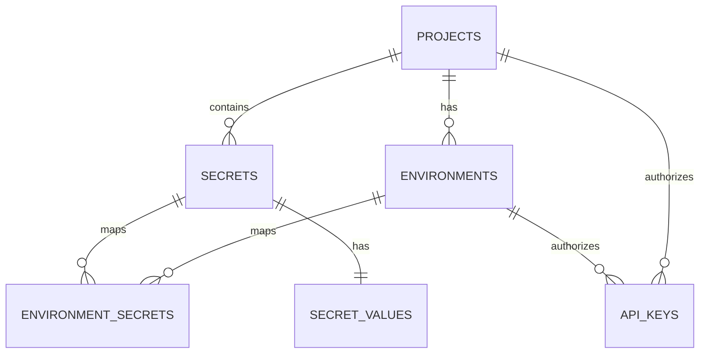

# EnvSync Repository Overview

**EnvSync** is a self-hosted environment variable and secrets management application. It allows developers to organize their configuration variables into **Projects**, assign them to specific **Environments** (e.g., Development, Staging, Production), and securely access or sync them via **API Keys**.

---

## 📁 Repository Structure

```
EnvSync/
├── Client/                 # Frontend dashboard (Vite + React + Tailwind CSS)
│   ├── src/
│   │   ├── api/            # API client and endpoints wrapper
│   │   ├── components/     # Reusable UI elements (Modals, Tables, Cards, etc.)
│   │   ├── context(s)/     # React context providers (e.g., ThemeContext)
│   │   ├── hooks/          # Custom Hooks (useFetch, useToast)
│   │   └── pages/          # Dashboard page components (Landing, Projects, Environments, Secrets, ApiKeys, Settings)
│   └── package.json
│
├── WebService/             # Backend API (Node.js Express + pg for PostgreSQL)
│   ├── controllers/        # Request handlers mapping API routes to services
│   ├── model/              # Response structure definitions
│   ├── routes/             # Express route configurations
│   ├── Services/           # Business logic layer (EnvSyncService)
│   ├── Utilities/          # DB connection, Repository layer, and instrument monitoring
│   └── package.json
│
├── Database_backups/       # Contains PostgreSQL schema/data dumps (envsync_backup.dump)
└── Jmeter/                 # JMeter scripts and summary CSVs for load testing
```

---

## ⚙️ Technical Stack

### Frontend (`Client/`)
* **Framework**: React 19 + React Router v6
* **Build Tool**: Vite
* **Styling**: Tailwind CSS + PostCSS
* **State/Data Fetching**: `@tanstack/react-query` + custom fetch hook (`useFetch`)
* **Drag-and-Drop / Interactive UI**: `@dnd-kit/core`
* **Icons**: `lucide-react`

### Backend (`WebService/`)
* **Framework**: Express 5 (latest pre-release)
* **Database Driver**: `pg` (PostgreSQL client)
* **Authentication**: Clerk Integration (`@clerk/express`, currently paused/commented out for local homelab integration)
* **Monitoring & Profiling**: Sentry (`@sentry/node`, `@sentry/profiling-node`)
* **Process Manager**: `nodemon` (development)

---

## 🗄️ Database & Schema Design

Based on queries in [EnvSyncRepo.js](file:///Users/varunharinath/Projects/EnvSync/WebService/Utilities/EnvSyncRepo.js), the system manages these main entities:



1. **`projects`**: Top-level containers for all settings.
2. **`environments`**: Associated with a project (e.g., Production, Staging). Holds metadata and count of mapped secrets.
3. **`secrets`**: Project-wide variable definitions (identified by name).
4. **`secret_values`**: Holds the actual sensitive value linked to each secret.
5. **`environment_secrets`**: A join table mapping which `secrets` are active within which `environments`.
6. **`api_keys`**: Associated with a project and environment, authorizing external clients to pull specific synced configurations (stored as hashes and prefixes).

---

## 📡 Backend API Endpoints

The API is exposed under `/api/v1` and runs on port `8080`.

| Category | Endpoint | HTTP Method | Action |
|---|---|---|---|
| **Projects** | `/api/v1/project` | `POST` | Create a new project |
| | `/api/v1/project/getProjects` | `GET` | Get all projects |
| | `/api/v1/project/getProjectById/:project_id` | `GET` | Get project details by ID |
| | `/api/v1/project/updateProjectById/:project_id` | `PATCH` | Update project name |
| | `/api/v1/project/deleteproject/:project_id` | `DELETE` | Delete project |
| **Environments** | `/api/v1/environment` | `POST` | Create a new environment |
| | `/api/v1/environment/getEnvironmentById/:project_id` | `GET` | Get environments for a project |
| | `/api/v1/environment/updateEnvironmentById/:env_id` | `PATCH` | Update environment name |
| | `/api/v1/environment/deleteEnvironmentById/:env_id` | `DELETE` | Delete environment |
| **Secrets** | `/api/v1/secret` | `POST` | Create secret (atomic transaction) |
| | `/api/v1/secret/getSecretsByProjectId/:proj_id` | `GET` | Get secrets and their values |
| | `/api/v1/secret/updateSecretsBySecretId/:secret_id` | `PATCH` | Update secret (atomic transaction) |
| | `/api/v1/secret/deleteSecretBySecretId/:secret_id` | `DELETE` | Delete secret (atomic transaction) |
| **Env Mapping** | `/api/v1/environment_secret` | `POST` | Map secret to environment |
| | `/api/v1/environment_secret/getEnvironmentSecretsById/:env_id`| `GET`| Get secrets mapped to environment |
| | `/api/v1/environment_secret/updateEnvironmentSecretById/:id` | `PATCH` | Update secret environment mapping |
| | `/api/v1/environment_secret/deleteEnvironmentSecretById/:id` | `DELETE` | Remove mapping |
| **API Keys** | `/api/v1/api/newApi` | `POST` | Generate new API key |
| | `/api/v1/api/project/:project_id` | `GET` | Get API keys of a project |
| | `/api/v1/api/:id` | `DELETE` | Revoke/delete an API key |
